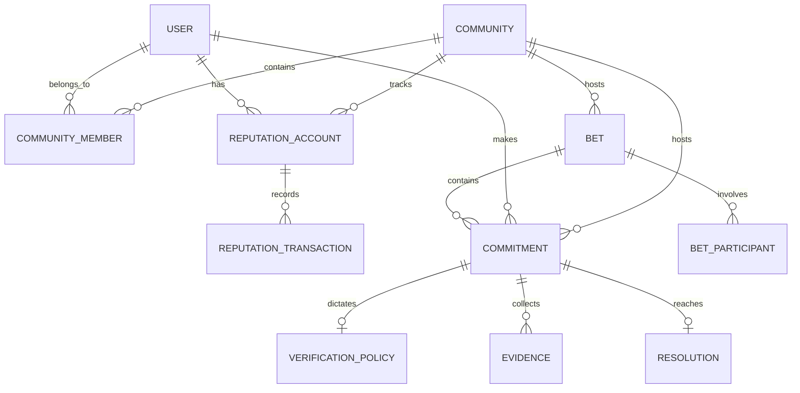
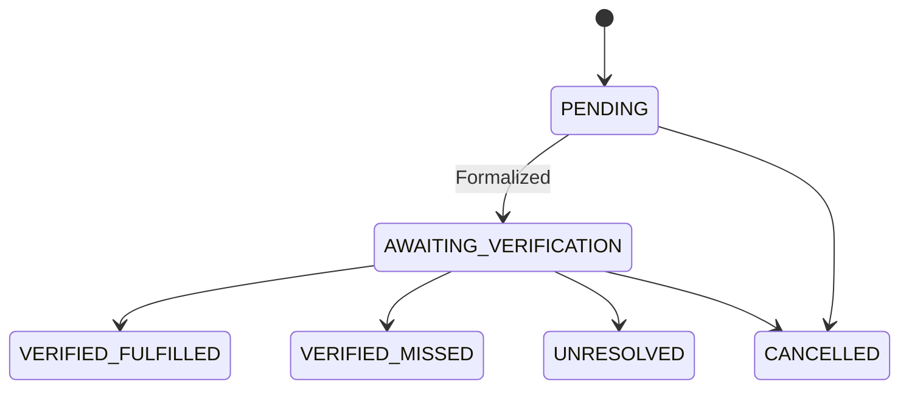
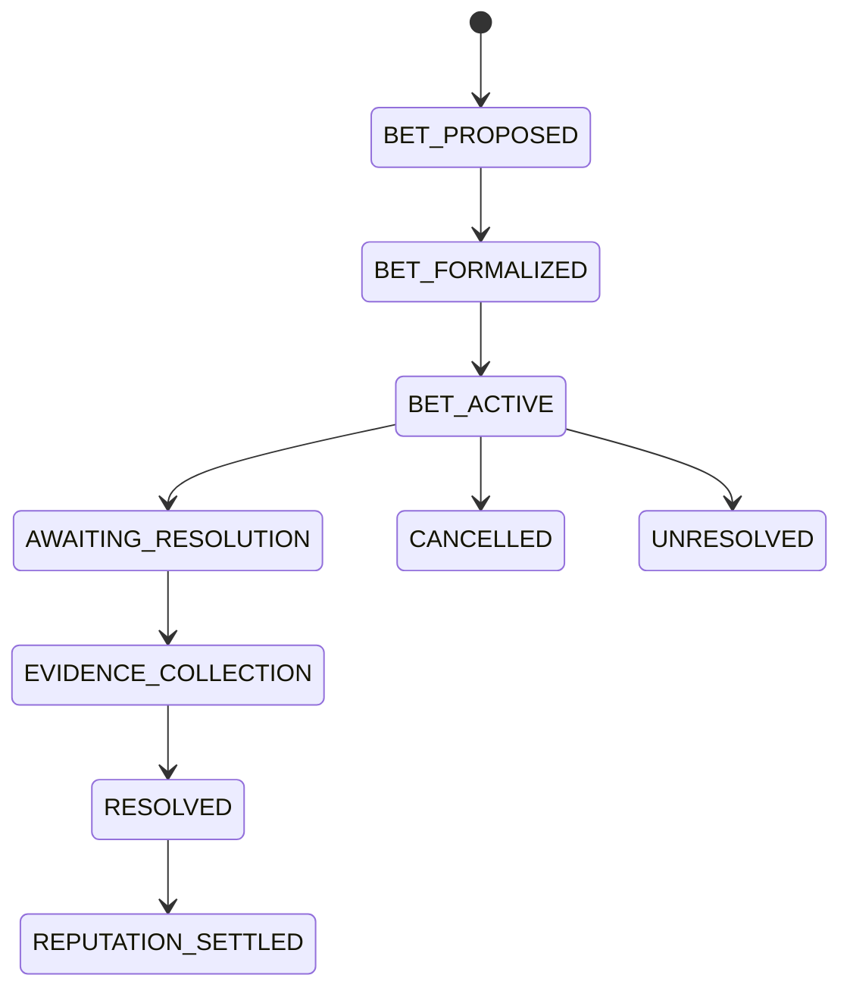

# --- FILE: API.md ---

# API: Aether

## 1. Framework
The API uses **Express**. (Fastify is explicitly out of scope).

## 2. Responsibilities
- Receives webhooks from Caspian.
- Exposes Reputation and Commitment endpoints for the Next.js Dashboard.
- Enforces strict authorization, rate limiting, and Zod validation.


# --- FILE: ARCHITECTURE.md ---

# Architecture Overview: Aether

## 1. Purpose
Aether is a **multi-channel AI Commitment Engine**.

Core product statement:
*"Aether remembers what people say they will do, determines how that commitment can be verified, waits until the appropriate condition or deadline, checks the evidence, updates reputation, and comes back with the result."*

Aether is NOT a generic AI assistant, a general-purpose software orchestrator, an AI tutor, or a collection of unrelated specialized agents.

## 2. The Three Layers
The core system is strictly separated into three layers:

1. **COMMITMENT ENGINE**: Turns natural-language statements into structured commitments. Formalizes who, what, and when. Scoped to a Community.
2. **VERIFICATION ENGINE**: Uses deterministic code (not LLMs) to query external sources of truth (e.g., GitHub, HTTP) to collect evidence and evaluate success conditions.
3. **REPUTATION / REWARDS ENGINE**: An immutable, transaction-based ledger that rewards or penalizes users when commitments are resolved. Reputation is scoped to a Community.

## 3. The Bet
"The Bet" is the flagship social/hackathon experience built on top of these three layers. It identifies verifiable disagreements and formalizes them, using Reputation points as stakes. It does not introduce new infrastructure; it orchestrates the existing engines.

## 4. End-to-End Flow & Architecture

```text
                    Discord
                    Telegram
                    Slack
                       │
                       ▼
                    Caspian
                       │
                       ▼
                 Aether Handler
                       │
                       ▼
              Commitment Engine
                       │
          ┌────────────┼────────────┐
          ▼            ▼            ▼
   Verification     Scheduler    Reputation
      Engine                       Engine
          │            │            │
          └────────────┼────────────┘
                       ▼
                    BullMQ
                       │
                       ▼
                Verification Workers
                       │
                ┌──────┴──────┐
                ▼             ▼
             GitHub          HTTP
                │             │
                └──────┬──────┘
                       ▼
                    Evidence
                       │
                       ▼
                   Resolver
                       │
                       ▼
                Reputation Ledger
                       │
                       ▼
                    Caspian
                       │
                       ▼
                   User
```

## 5. Tech Stack
- **Language**: TypeScript
- **Runtime**: Node.js
- **API**: Express
- **AI**: Featherless
- **Communication**: Caspian SDK
- **Database**: PostgreSQL (via Prisma ORM)
- **Queue**: BullMQ (backed by Redis)
- **Frontend**: Next.js + React (Tailwind CSS)
- **Infrastructure**: Docker / Docker Compose

### Managed Database
Supabase may be used as the managed PostgreSQL provider for deployment. However, Prisma continues to interact with PostgreSQL through standard `DATABASE_URL` connection strings. There is no Supabase-specific application coupling. Local Docker PostgreSQL is used for development.


# --- FILE: CONTRIBUTING.md ---

# Contributing to Aether

## 1. Purpose
This document outlines the strict engineering standards and coding philosophy required to contribute to the Aether codebase. Because we are building a production-grade orchestration engine, adhering to these standards is non-negotiable to maintain velocity and minimize technical debt.

## 2. Core Architectural Philosophy
Before writing code, internalize these rules:
1. **The AI only plans.** Never write code where the AI actively executes tasks.
2. **Workers only execute.** Never give a worker access to the Orchestrator's database or knowledge of the broader DAG.
3. **Controllers are dumb.** Never put business logic in an Express controller. They only parse, validate, and respond.
4. **Events over RPC.** If Service A needs to tell Service B something happened, emit an event. Do not make a synchronous HTTP call between them.

## 3. Folder Structure & Dependency Rules

We use a Turborepo monorepo.
- `apps/`: Deployable applications (API, Dashboard).
- `services/`: Independent backend modules (Planner, Orchestrator, Worker).
- `packages/`: Reusable, strictly scoped internal libraries.

### Strict Dependency Rules
- Services and Apps may import `packages/*`.
- A `package` may **never** import an `app` or a `service`.
- Services may **never** import other services directly (e.g., the `api` cannot import the `orchestrator`). They must communicate via the shared `packages/queue` or `packages/events` abstraction.

## 4. Naming Conventions

- **Files and Folders:** Use `kebab-case.ts` (e.g., `workflow-service.ts`, `dependency-resolver.ts`).
- **Interfaces/Types:** Use PascalCase. Prefix with `I` is **banned** (use `Workflow`, not `IWorkflow`).
- **Classes:** PascalCase.
- **Functions/Variables:** camelCase.
- **Constants/Enums:** UPPER_SNAKE_CASE.
- **Database Tables:** snake_case, plural (e.g., `workflow_executions`).

## 5. Testing Strategy

Code without tests is legacy code the moment it is merged. We use `Jest`.
1. **Unit Tests:** Mandatory for all business logic, particularly DAG resolution, retry calculation, and prompt generation. Mock external dependencies (DB, Redis, Featherless).
2. **Integration Tests:** Required for API endpoints. These spin up a test Postgres database and verify the entire HTTP request lifecycle (from Zod validation to database insertion).
3. **End-to-End (E2E):** (Future) Will spin up the entire Docker Compose stack and run a real workflow from the API to the Worker and back.

## 6. Commit Conventions

We strictly follow [Conventional Commits](https://www.conventionalcommits.org/). This allows us to auto-generate changelogs and determine semantic version bumps.

- `feat:` A new feature.
- `fix:` A bug fix.
- `chore:` Maintenance (e.g., updating dependencies, refactoring).
- `docs:` Documentation changes.
- `test:` Adding missing tests.

*Example:* `feat(planner): add support for conditional branching in DAG generation`

## 7. Pull Request Review Checklist

Before requesting a review from a Senior/Principal Engineer, ensure:
- [ ] Zod schemas have been created/updated for all new inputs.
- [ ] No secrets or API keys are hardcoded.
- [ ] No synchronous calls were introduced between decoupled services.
- [ ] Unit tests cover both the happy path and the error boundaries.
- [ ] The `ARCHITECTURE.md` or `DOMAIN_MODEL.md` has been updated if structural changes were made.
- [ ] Commits follow the conventional format.


# --- FILE: DATABASE.md ---

# Database Design: Aether

## 1. Schema Overview
Aether uses PostgreSQL and Prisma. Supabase may be used as the managed provider in production.

### 1.1 Community Models
- `communities`: Logical workspaces mapping a `platform` + `external_id` (e.g., a Discord server).
- `community_members`: Join table associating `users` to `communities`.

### 1.2 Reputation Models
- `reputation_accounts`: Tracks the aggregated balance of a user **within a specific community**. Contains a compound unique constraint on `[user_id, community_id]` and an index on `[community_id, balance]` optimized for Leaderboard queries.
- `reputation_transactions`: Immutable ledger. Includes `transaction_type`, `amount`, references to the `Commitment` or `Bet`, and an idempotency `reference_key` to prevent duplicate processing.

### 1.3 Core Commitment Models
- `commitments`: Contains `reward_penalty_policy` and core formalization data. Optionally linked to a `community_id`.
- `verification_policies`: Flexible configuration for verification sources. Uses string identifiers, not enums, for `verifier_type`.

### 1.4 Verification Models
- `evidence`: Point-in-time snapshots of external queries.
- `resolutions`: Explicit deterministic outcomes mapping evidence to `FULFILLED` or `MISSED`.

### 1.5 Bet Models
- `bets`: The overarching dispute entity linked to a `community_id`.
- `bet_participants`: Join table between Bets and Users, explicitly storing the `stake` (Reputation amount).

### 1.6 Events
- `events`: Append-only audit log for lifecycle state changes. Links to both Commitments and Bets.

## 2. Integrity and Deletions
Aether favors preserving historical auditability:
- Deleting a User or Community will Cascade into Memberships.
- However, `reputation_transactions`, `commitments`, and `evidence` use `Restrict` or `SetNull` foreign key policies where appropriate to prevent catastrophic blind cascades from destroying audit logs or the system's ledger history.


# --- FILE: DOMAIN_MODEL.md ---

# Domain Model: Aether

## 1. Entity Relationship Overview



## 2. Core Entities

### 2.1 Community & CommunityMember
Represents a logical Aether community (e.g., a Discord server or Telegram group) defined by a `platform` and `externalId`. Users are linked to Communities via `CommunityMember`.

### 2.2 User
Represents a human actor communicating via Caspian channels. A User can belong to many Communities and has separate reputation in each.

### 2.3 ReputationAccount & ReputationTransaction
Reputation is **scoped to a Community**. A User has one `ReputationAccount` per Community they are active in. 
Every reputation change (reward, penalty, bet won) generates an immutable `ReputationTransaction`. The `ReputationAccount` balance is the sum of these transactions. Reputation points are never simply mutated directly (no `user.points += 5`).
All transactions contain an idempotency `referenceKey` (e.g., `commitment:123:fulfilled`) to guarantee verifiable settlement without double-counting.

### 2.4 Commitment
The core formalized entity. It contains the `statement`, `deadline`, and the `rewardPenaltyPolicy` (e.g., +5 if fulfilled, -5 if missed). It retains references to the original channel and message, and links back to the originating `Community`.

### 2.5 VerificationPolicy
Defines deterministically how to verify a commitment using string identifiers like `github.issue_status`.

### 2.6 Evidence & Resolution
**Evidence** is an immutable snapshot of an external API (e.g., GitHub PR status). **Resolution** is the deterministic result based on Evidence.

### 2.7 Bet & BetParticipant
Groups competing claims (Commitments) and formalizes stakes. Stakes use Reputation points from the participant's community-scoped `ReputationAccount`. Real money is never used.


# --- FILE: EVENTS.md ---

# System Events: Aether

## 1. Append-Only Audit Log
Aether records important lifecycle transitions into an immutable `events` table. Events cannot be silently modified.

## 2. Core Events
- `COMMITMENT_CREATED`
- `COMMITMENT_UPDATED`
- `VERIFICATION_SCHEDULED`
- `VERIFICATION_STARTED`
- `EVIDENCE_COLLECTED`
- `COMMITMENT_FULFILLED`
- `COMMITMENT_MISSED`
- `COMMITMENT_CANCELLED`
- `REPUTATION_REWARDED`
- `REPUTATION_PENALIZED`
- `BET_CREATED`
- `BET_ACCEPTED`
- `BET_RESOLUTION_STARTED`
- `BET_RESOLVED`


# --- FILE: FINAL_RESULT.md ---

# Aether: The Final Result & Product Vision

This document serves as the foundational product manifesto for **Aether**. It is not a technical specification; rather, it is the absolute single source of truth for what the finished version of Aether must feel like from the user's perspective. 

Every engineer, AI agent, or contributor must read this document before proposing architectural changes or implementing new features. Our architecture, database schema, and orchestration layers exist solely to serve the vision outlined below. Every component we develop must strictly adhere to **production standards**, ensuring scalability, deterministic execution, and extreme reliability.

---

## 1. Vision: An AI-Powered Software Engineering Orchestrator

The technology industry is currently saturated with "AI chatbots"—interfaces where a user types a prompt and waits for a block of text in return. 

**Aether is not an AI chatbot. It is not a generic productivity assistant.** 

For Version 1, Aether is laser-focused on a single domain: it is an **AI-powered Software Engineering Orchestrator.** Its purpose is to convert natural language software requests into executable workflows that are planned, scheduled, executed, monitored, and delivered automatically.

When a user interacts with the system, they are handing off a complex engineering objective. Aether assumes full responsibility for the lifecycle of that objective:
- **Aether plans it.**
- **Aether executes it.**
- **Aether continuously informs the user.**

The psychological shift is critical. The user should feel like they have hired an autonomous, highly capable software engineer rather than starting a chat conversation. The platform is trusted not just because it is intelligent, but because it is relentlessly methodical, production-grade, and transparent in how it turns intent into reality.

---

## 2. Primary User Journey

To understand the product, we must look at the complete, end-to-end user experience. 

Imagine a product manager or lead developer opening their company's Slack or Discord workspace. They navigate to the Aether channel and send a simple message:

> *"Create a 2D platformer game in HTML5 Canvas, commit it to GitHub, deploy it, and notify me when it is finished."*

**The Immediate Hand-off**
Instantly, the message is normalized by the **Caspian SDK** and handed to Aether's **Communication Layer**. The **Intent Router** determines this is an Execution Intent (not a casual chat) and forwards it to the Planner. The Discord bot replies:
> *"Workflow accepted. Planning and execution have begun. Track live progress here: [https://dashboard.aether.internal/runs/wkf_9823]*"

The user clicks the link and is taken out of the chat interface and into the **Aether Dashboard**. 

**The Real-Time Symphony**
As the user watches the dashboard, it begins to light up and update in real-time without a single page refresh. 
- They see the **Planner** finish its thinking phase, instantly generating a Directed Acyclic Graph (DAG) representing the software engineering workflow.
- They watch as the **Scheduler** transitions the first set of parallel tasks from `PENDING` to `QUEUED`.
- They see ephemeral **Workers** pick up tasks, turning the nodes blue (`RUNNING`).
- As tasks complete, nodes turn green (`COMPLETED`). 

**Artifacts Materialize**
As the execution progresses, generated files appear live in the dashboard's artifact viewer. The user watches HTML, CSS, and JavaScript files stream into existence. They see a git repository being initialized in a temporary workspace. They see the worker commit the code and push it to GitHub. 

**The Conclusion**
Once the final deployment step turns green, the Orchestrator emits a Workflow Event. The Communication Layer receives this event, formats a notification, and dispatches it via Caspian. The user's Discord pings again with a completion notification containing the GitHub repository URL and the live deployment link. 

The entire complex sequence of events occurred autonomously, transparently, and deterministically at production scale.

---

## 3. The Dashboard Experience

A foundational tenet of Aether is that **Discord (or Slack, or Telegram) is only a communication channel.** It is the edge of our system. **The Dashboard is the primary user interface.**

The Aether dashboard is designed for engineers. It should look, feel, and operate with the same premium, robust quality as industry-standard tools like GitHub Actions, the Temporal UI, or the Vercel Deployment dashboard. It must convey massive amounts of complex orchestration data effortlessly.

The dashboard updates instantaneously via WebSockets or Server-Sent Events. The user never has to press `F5` to know what is happening.

When viewing a live workflow execution, the dashboard displays:
- **Workflow Status:** A high-level banner showing `RUNNING`, `FAILED`, `COMPLETED`, or `PENDING`.
- **Planner Summary:** The natural language breakdown of *why* the AI constructed the workflow the way it did.
- **Execution Graph:** A visual, interactive DAG (Directed Acyclic Graph) showing the complex dependency tree of the workflow.
- **Node Statuses:** Clear visual indicators for the current running step, steps that are waiting on dependencies, and steps that have completed successfully.
- **Execution Logs:** A streaming terminal window attached to the currently active step.
- **Artifact Viewer:** A file-tree view showing generated code dynamically updating as workers yield results.
- **Deep Links:** Instantly accessible links to the generated GitHub repositories or live Vercel deployments.
- **Execution Timeline:** A Gantt-chart style timeline showing how long each step took.
- **Worker Telemetry:** Identification of the specific worker host executing a specific task.
- **Resilience Data:** Clear visibility into retry attempts, backoff timers, and exact error stack traces if a task transiently fails.

---

## 4. Example Demo (The Hackathon Moment)

This is the exact sequence of events that will occur during the hackathon demonstration to secure a victory.

1. **The Prompt:** The judge is handed a tablet with Discord open and types: *"Create a simple 2D platformer game."*
2. **The Hand-off:** Aether instantly replies with the dashboard link. The judge clicks it, opening the dashboard on a large projector screen.
3. **The Brain:** The dashboard shows the Planner thinking. Within seconds, a complex, 10-node dependency graph visually materializes on the screen.
4. **The Execution:** The nodes begin executing in parallel. The judge sees workers rapidly claiming tasks.
5. **The Proof:** On the right side of the dashboard, raw JavaScript code begins writing itself into the artifact viewer. 
6. **The Assembly:** A `git.push` step turns green. A `vercel.deploy` step begins spinning.
7. **The Climax:** The workflow completes. The Discord channel dings loudly: *"Workflow Completed. Play your game here."*
8. **The Win:** The judge clicks the link, and the 2D platformer game launches perfectly in their browser. 

More importantly than the game itself, **the judge understands every single step that occurred to build it.** It was not a magic black box; it was a transparent, orchestrated engineering pipeline.

---

## 5. Engineering Philosophy

**Aether is not replacing software engineers.** It automates repetitive engineering workflows while keeping the human in complete control. 

The architecture is governed by a strict separation of concerns:
- **The Planner decides WHAT to build.** It translates human intent into a structured, deterministic blueprint (DAG).
- **The Orchestrator decides HOW work flows.** It coordinates dependencies, schedules tasks, and reacts to events.
- **Workers execute isolated engineering tasks.** They are stateless compute nodes that run isolated functions (e.g., executing a bash command or writing a file).
- **The Task Registry contains engineering capabilities.** It maps the universe of what Aether can do (e.g., `git.clone`, `docker.build`, `shell.exec`).
- **The Dashboard provides complete execution visibility.**

Visibility is paramount. Nothing should happen invisibly. If Aether makes a decision, it must be logged. If a worker fails, the error must be surfaced. Every execution must adhere strictly to production standards—capable of surviving pod restarts, transient network failures, and unpredictable worker crashes.

---

## 6. What Success Looks Like

Success is defined by the psychological state of the user. The user should never wonder, *"Is it doing anything? Did it freeze?"*

Because the dashboard continuously communicates progress, the user's anxiety is completely eliminated. **The user trusts the platform because every action is visible.** 

Every generated artifact is open for inspection. Every completed workflow is persisted in the database forever, allowing the user to replay the timeline of events months later and completely understand how a specific result was achieved.

---

## 7. Long-Term Vision

Version 1 is strictly an AI Software Engineering Orchestrator. We explicitly avoid customer support chatbots, essay generation, or generic image processing in this phase.

However, the core architecture is completely domain-agnostic and will never change. The orchestrator, the database schema, and the scheduler will remain identical as we scale.

To add new capabilities in the future, engineers will simply register new capabilities inside the `packages/task-registry`:
- **Version 1:** AI Software Engineering
- **Version 2:** DevOps, Infrastructure, Cloud Deployments
- **Version 3:** General Workflow Automation (Data Pipelines, Support Automation, Movie Writing, etc.)

---

## 8. Engineering Principles

To ensure this vision becomes reality, all contributors to the Aether codebase must adhere strictly to these engineering principles:

1. **Keep Orchestration Generic:** The orchestrator must never contain business logic. It only knows about Nodes, Edges, Payloads, and States.
2. **Never Hardcode Workflows:** Every workflow must be dynamically generated by the Planner or explicitly defined in JSON.
3. **Never Tightly Couple Workers:** Workers must remain entirely stateless and "dumb." 
4. **Prefer Task Registration Over Conditional Branching:** If a new capability is needed, register a new `taskId` in the Task Registry.
5. **Prefer Observable Systems:** If a process takes longer than a few seconds, it must emit a state change so the user can see it on the dashboard.
6. **Every Workflow Must Be Replayable:** Because every state transition is recorded as an immutable event, the dashboard must be able to visually replay any historical workflow.
7. **Every Execution Must Be Traceable:** If a step fails, a developer must be able to trace it back to the exact Worker ID, timestamp, and Planner input that caused it.
8. **Every Task Must Be Independently Executable:** Tasks must not rely on the hidden local state of a previous task.
9. **The Database Stores State, The Task Registry Stores Capabilities:** The database tracks what happened; the registry tracks what is possible.
10. **The Scheduler Owns Execution Order:** Workers never decide what to do next. They only execute the single task immediately in front of them and report back.

---
*This manifesto is the guiding light for Aether. Let's build the future of autonomous software engineering orchestration.*


# --- FILE: LEADERBOARD.md ---

# Community Leaderboards: Aether

## 1. Concept
The Leaderboard is a query over the `reputation_accounts` table. There is no dedicated database table for the leaderboard.

Because reputation is scoped to a Community, a user can have different reputation scores across different communities.

## 2. Database Support
The `reputation_accounts` table has an index on `[communityId, balance]` to efficiently support the underlying query:

```sql
SELECT *
FROM reputation_accounts
WHERE community_id = ?
ORDER BY balance DESC
```

## 3. UI Display
The Aether dashboard will display the Community Leaderboard with derived statistics (e.g., fulfillment rate, bets won), which can be calculated on-the-fly or cached by the API:

```text
AETHER REPUTATION

1. Ashutosh — 842
   94% fulfillment
   7 bets won

2. Anurag — 790
   91% fulfillment
   5 bets won
```


# --- FILE: NOTIFICATIONS.md ---

# Notifications (Caspian): Aether

## 1. Single Agent Identity
Caspian is the core communication dependency. Aether uses ONE message handling architecture for Discord, Telegram, and Slack. 
We do NOT create separate `discordAgent` or `telegramAgent` implementations.

## 2. Routing
The same Commitment, Verification, and Reputation engines operate regardless of channel. When a resolution is reached, Caspian ensures the response is delivered to the originating channel and thread.


# --- FILE: PLANNER.md ---

# LLM Reasoning: Aether

## 1. Purpose
The LLM converts unstructured text into structured Commitments.

## 2. CRITICAL PRINCIPLE: LLM IS NOT THE SOURCE OF TRUTH
The LLM must **never** be treated as the final source of truth when an objective external source is available. 
Never implement: *"LLM thinks the user probably fulfilled the commitment."*

**The LLM ONLY:**
- Detects commitments.
- Formalizes deadlines.
- Proposes verification strategies.
- Prompts for missing info (e.g. "What should I use as proof?").

## 3. Subjective Claims
Aether should NOT attempt to judge arbitrary subjective statements ("React is better than Vue"). It must request measurable criteria or reject the claim as non-verifiable.


# --- FILE: QUEUE.md ---

# Queue: Aether

## 1. Architecture
Aether uses **BullMQ** running on **Redis**.

## 2. Usage
- **Verification**: Scheduled execution of external API checks.
- **Notifications**: Outbound messaging via Caspian.
- **Reputation**: Processing ledger transactions asynchronously to prevent race conditions.


# --- FILE: README.md ---

# docs
**Purpose:** System documentation (Architecture, Execution Flow, Planner, Scheduler, Worker Lifecycle, API, Deployment, Future Roadmap).


# --- FILE: ROADMAP.md ---

# Roadmap: Aether

## PHASE 1 — FOUNDATION
- Express API
- PostgreSQL
- Prisma
- Redis
- BullMQ
- repositories
- events

## PHASE 2 — COMMITMENT ENGINE
- commitment extraction
- commitment formalization
- deadline handling
- verification policy
- lifecycle

## PHASE 3 — VERIFICATION
- Verification Registry
- GitHub integration
- issue verifier
- PR verifier
- commit verifier
- CI verifier
- release verifier
- evidence storage
- deterministic resolution

## PHASE 4 — REPUTATION
- ReputationAccount
- ReputationTransaction
- reward policies
- penalty policies
- fulfillment statistics
- audit ledger

## PHASE 5 — CASPIAN
- Discord
- Telegram
- Slack
- unified message handling

## PHASE 6 — THE BET
- disagreement detection
- claim formalization
- participants
- reputation stakes
- resolution criteria
- evidence
- verdict
- reputation settlement
- receipts

## PHASE 7 — HARDENING
- idempotency
- retries
- observability
- rate limiting
- security
- failure recovery
- production deployment

## PHASE 8 — FUTURE EXPANSIONS (IDEAS)
- **Expand the Verification Registry**: Add integrations for Strava API (e.g., "I'll run 5k by Sunday"), Vercel API ("I'll ship the frontend"), and LeetCode ("I'll solve 5 mediums").
- **The "Oracle" Fallback (Community Vote)**: For bets that cannot be deterministically verified via an API (e.g., "My design will look better than yours"), introduce a \`COMMUNITY_VOTE\` verification policy where community members vote to resolve the bet, acting as a human oracle.


# --- FILE: SCHEDULER.md ---

# Scheduler: Aether

## 1. Purpose
Aether waits until the appropriate condition or deadline to verify a commitment. The scheduler handles this temporal execution.

## 2. Implementation
When a Commitment enters `AWAITING_VERIFICATION`, a job is enqueued to **BullMQ** (Redis) with a `delay` matching the deadline.

Once the time expires, BullMQ pushes the job to the Verification Workers. PostgreSQL retains the `resolutionAt` timestamp to ensure delayed jobs can be recreated if Redis is restarted.


# --- FILE: SECURITY.md ---

# Security: Aether

## 1. Trust & Authority
- Users cannot arbitrarily award themselves Reputation. Every transaction requires system-level authorization.
- The system prevents silent score manipulation through the immutable `ReputationTransaction` ledger.

## 2. Infrastructure
- No unrestricted shell execution based on user messages. Verification is strictly isolated to explicit API integrations (e.g. GitHub).
- Secrets (OAuth tokens) are managed via environment variables and never exposed in Caspian chat responses.

## 3. Worker Safety
Workers are idempotent. External API access relies on strict timeouts and robust retry behavior.


# --- FILE: STATE_MACHINE.md ---

# State Machines: Aether

## 1. Commitment Lifecycle


**Note on Cancellation**: If a user cancels a commitment (and policy permits), it enters `CANCELLED`. It does *not* count as `MISSED` and does not apply penalties.

## 2. Bet Lifecycle




# --- FILE: WORKERS.md ---

# Verification Workers: Aether

## 1. Purpose
Workers execute deterministic verification code to query external sources of truth (e.g. GitHub APIs).

## 2. Verification Registry
Verification capabilities are registered using string identifiers in a code registry. 
*Example Capabilities:*
- `github.issue_status`
- `github.pull_request_status`
- `github.commit_exists`
- `github.ci_status`
- `github.release_exists`
- `http.endpoint_status`

## 3. Execution
Workers pull from BullMQ, run the explicit verification strategy, collect JSON Evidence, and determine a deterministic resolution (FULFILLED or MISSED). Workers are entirely idempotent.
