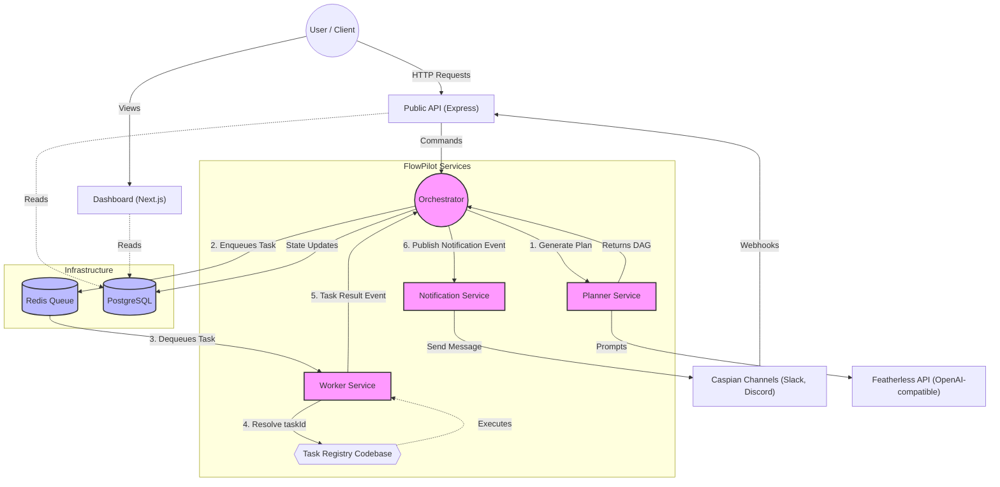

# Architecture Overview: FlowPilot

## 1. Purpose
This document provides the high-level architecture and design philosophy for **FlowPilot**, an AI Workflow Orchestration Platform. It acts as the ultimate reference for the system topology, component responsibilities, and key technical decisions. It establishes the baseline for how we think about, structure, and evolve the platform.

See [DOMAIN_MODEL.md](DOMAIN_MODEL.md) for entity definitions and [STATE_MACHINE.md](STATE_MACHINE.md) for lifecycle details.

## 2. Scope
This document covers the core services within the FlowPilot monorepo, their boundaries, the underlying technology stack, and the event-driven communication model binding them together. It outlines our MVP approach and how the system must scale for future production workloads.

## 3. Core Philosophy & Design Principles
FlowPilot is built on a strict separation of **reasoning** from **execution**. 
Unlike conversational AI that directly attempts to answer or act, FlowPilot treats AI strictly as a *Planner*. 

1. **AI Only Plans:** The Planner translates natural language into a directed acyclic graph (DAG) of executable steps. It never executes code.
2. **Workers Only Execute:** Workers are "dumb" runners. They receive a discrete task, execute it, and return a result. They are entirely unaware of the broader workflow, DAG structure, or subsequent steps.
3. **The Orchestrator Owns State:** The orchestrator is the central brain coordinating execution, handling retries, dependency resolution, and state management.
4. **Controllers Are Dumb:** HTTP controllers handle request parsing and validation. They never contain business logic.
5. **Event-Driven:** Components communicate via asynchronous events (e.g., \`WorkflowStarted\`, \`StepQueued\`) rather than synchronous RPC, decoupling the architecture.
6. **Replaceable Abstractions:** External providers (Featherless, Redis, Docker) sit behind abstraction interfaces to ensure they can be hot-swapped without refactoring core logic.

## 4. High-Level Architecture

The following diagram illustrates the boundaries and communication flow between FlowPilot's components.

## 5. Component Responsibilities

### API (\`apps/api\`)
- **Responsibility:** Exposes RESTful HTTP endpoints for external clients and webhook providers. 
- **Boundaries:** Validates payloads using Zod, authenticates requests, and dispatches commands to the Orchestrator. It never mutates state directly or schedules tasks.

### Dashboard (\`apps/dashboard\`)
- **Responsibility:** Provides visual observability. Displays workflow DAGs, worker health, logs, and queue metrics.
- **Boundaries:** Strictly read-only for MVP (visualizing Postgres data).

### Planner (\`services/planner\`)
- **Responsibility:** Interacts with LLMs to convert natural language intents into structured, executable JSON DAGs.
- **Boundaries:** Understands prompt engineering and LLM schemas. Has zero knowledge of worker capabilities or workflow execution state. 

### Orchestrator (\`services/orchestrator\`)
- **Responsibility:** The execution engine. Resolves DAG dependencies, manages state transitions, enqueues tasks, processes worker results, and dictates retry policies.
- **Boundaries:** Does not execute the actual work. Does not talk to external APIs directly (apart from publishing events to internal queues).

### Worker (\`services/worker\`)
- **Responsibility:** Polls the queue, executes a specific script or function, and returns success/failure to the orchestrator.
- **Boundaries:** Stateless and dumb. A worker should be completely expendable and horizontally scalable.

### Notification (\`services/notification\`)
- **Responsibility:** Listens for orchestrator events (e.g., \`WorkflowCompleted\`, \`StepFailed\`) and formats human-readable alerts dispatched via the Caspian SDK.
- **Boundaries:** Never alters workflow state. Simply consumes events and fires external network requests.

## 6. Design Decisions & Trade-offs

### 6.1 Node.js / Express 5 over Fastify
- **Why Chosen:** Express is universally understood, has a massive ecosystem, and Express 5 natively supports asynchronous error handling (eliminating the need for \`express-async-errors\`).
- **Alternatives Considered:** Fastify.
- **Why Rejected:** While Fastify boasts higher synthetic throughput, Express 5 provides sufficient performance for an IO-bound orchestration layer, with significantly lower onboarding friction for new engineers. 

### 6.2 Task Registry Pattern vs Enums
- **Why Chosen:** We use a dynamic `taskId` (e.g., `image.compress`) to identify capabilities, mapped via a central Task Registry in the codebase, instead of a database enum (`TaskType`).
- **Benefits:** The database and core Orchestrator do not need schema migrations or code changes to support new capabilities. Workers can dynamically register and execute new capabilities simply by adding a new task module in the `packages/task-registry`.
- **Alternatives Considered:** Hardcoded Prisma Enums.
- **Why Rejected:** Enums tightly couple the persistence layer to the compute layer's capabilities, violating the Open-Closed Principle and making extensions tedious.

### 6.3 Postgres + Prisma for State
- **Why Chosen:** Relational databases provide strict ACID guarantees essential for orchestrating state transitions reliably. Prisma offers excellent Developer Experience (DX) and type safety.
- **Alternatives Considered:** MongoDB (NoSQL).
- **Why Rejected:** Workflow states, dependencies, and execution histories are inherently relational. NoSQL would force us to handle referential integrity in the application layer.

### 6.3 Redis for Queueing & Events
- **Why Chosen (MVP):** Redis (via \`bullmq\` or custom \`ioredis\` scripts) is lightweight, easy to deploy locally, and sufficient for building reliable delayed queues and pub/sub mechanisms.
- **Alternatives Considered:** RabbitMQ, Apache Kafka, AWS SQS.
- **Why Rejected (For Now):** Kafka and RabbitMQ require significant operational overhead and infrastructure complexity for a two-week MVP. 
- **Future Production Requirement:** Once we exceed Redis memory limits or require strict multi-consumer durable event streams with replayability, the Queue abstraction layer will be hot-swapped to Kafka or AWS SQS.

### 6.4 Monorepo (Turborepo + pnpm)
- **Why Chosen:** Sharing interfaces (e.g., \`packages/types\`) across the API, Orchestrator, and Workers guarantees that a change to a workflow schema is enforced globally at compile time.
- **Alternatives Considered:** Polyrepo (one repository per service).
- **Why Rejected:** Polyrepos lead to version drift, complex local development setups, and duplicate boilerplate, which violates the MVP timeline constraint.

## 7. Future Improvements & Scalability
- **MVP vs. Production:** In the MVP, services may run as separate Node processes on a single VM (or via Docker Compose). For **Future Production**, each service will be packaged into a separate Docker container and orchestrated via Kubernetes.
- **Database Scalability:** The MVP uses a single logical PostgreSQL instance. In the future, high-volume tables (like execution logs) will be partitioned, or moved to a specialized time-series/OLAP database like ClickHouse.
- **Worker Isolation:** Currently, workers run code within their own Node context. In the future, workers will spin up ephemeral, sandboxed Docker containers or microVMs (Firecracker) to execute untrusted user code safely.

## 8. Open Questions
- *Authentication Strategy:* How will we handle tenant isolation in the database? Should we implement Row-Level Security (RLS) in Postgres or handle it purely at the application layer? (To be resolved in \`SECURITY.md\`).
- *Worker Languages:* Will the MVP workers only execute TypeScript, or do we need to support Python execution via WASM or child processes immediately?
