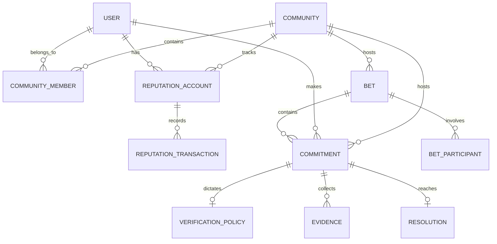

# Domain Model: Aether

## 1. Entity Relationship Overview

## 2. Core Entities

### 2.1 Community & CommunityMember
Represents a logical Aether community (e.g., a Discord server or Telegram group) defined by a `platform` and `externalId`. Users are linked to Communities via `CommunityMember`.

### 2.2 User
Represents a human actor communicating via Caspian channels. A User can belong to many Communities and has separate reputation in each.

### 2.3 ReputationAccount & ReputationTransaction
Reputation is **scoped to a Community**. A User has one `ReputationAccount` per Community they are active in. 
Every reputation change (reward, penalty, bet won) generates an immutable `ReputationTransaction`. The `ReputationAccount` balance is the sum of these transactions. Reputation points are never simply mutated directly (no `user.points += 5`).
All transactions contain an idempotency `referenceKey` (e.g., `commitment:123:fulfilled`) to guarantee verifiable settlement without double-counting.

### 2.4 Commitment
The core formalized entity. It contains the `statement`, `deadline`, and the `rewardPenaltyPolicy` (e.g., +5 if fulfilled, -5 if missed). It retains references to the original channel and message, and links back to the originating `Community`.

### 2.5 VerificationPolicy
Defines deterministically how to verify a commitment using string identifiers like `github.issue_status`.

### 2.6 Evidence & Resolution
**Evidence** is an immutable snapshot of an external API (e.g., GitHub PR status). **Resolution** is the deterministic result based on Evidence.

### 2.7 Bet & BetParticipant
Groups competing claims (Commitments) and formalizes stakes. Stakes use Reputation points from the participant's community-scoped `ReputationAccount`. Real money is never used.
