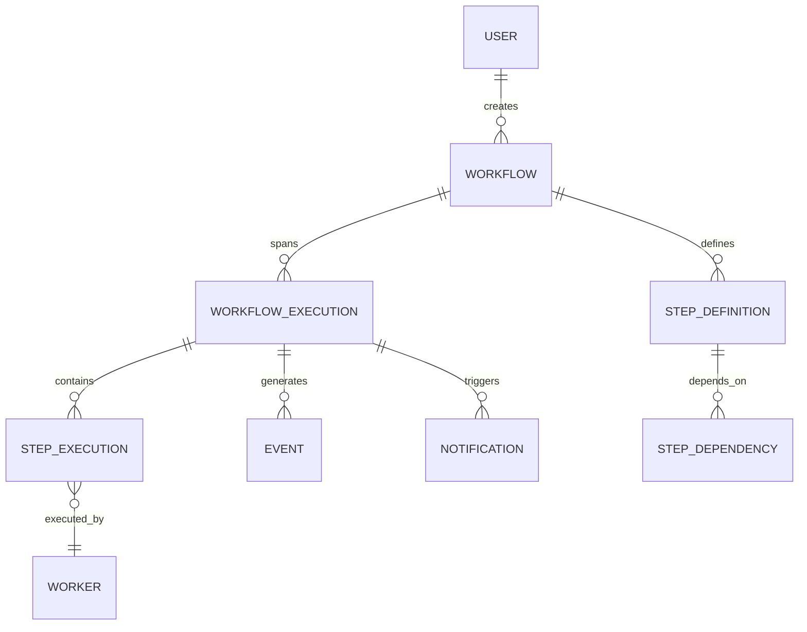

# Domain Model: FlowPilot

## 1. Purpose
This document strictly defines the core entities that make up the FlowPilot ecosystem. These entities form the ubiquitous language used by product, engineering, and the AI Planner. 

For the relational database schema implementation of this domain, refer to [DATABASE.md](DATABASE.md). For state transitions, refer to [STATE_MACHINE.md](STATE_MACHINE.md).

## 2. Entity Relationship Overview

The following diagram illustrates how the core entities relate to one another at a conceptual level.

## 3. Core Entities

---

### 3.1 User
**Purpose:** Represents a human or system actor interacting with FlowPilot.
- **Ownership:** API Service.
- **Relationships:** A User owns many Workflows.
- **Lifecycle:** Created upon signup/provisioning. Soft-deleted on account closure.
- **Fields:** \`id\`, \`email\`, \`api_key\`, \`created_at\`.
- **Future Extensibility:** (Production) Add RBAC (Role-Based Access Control), Organizations/Tenants, and Team structures.

---

### 3.2 Workflow (Definition)
**Purpose:** Represents a user's intent. It is the static blueprint generated by the Planner or defined manually. It does *not* contain runtime state.
- **Ownership:** API Service (CRUD) / Planner Service (Generation).
- **Relationships:** Belongs to a User. Has many Step Definitions. Has many Workflow Executions.
- **Lifecycle:** Created -> Updated -> Deprecated/Deleted.
- **Fields:** \`id\`, \`user_id\`, \`name\`, \`description\`, \`trigger_type\` (Manual, Cron, Webhook), \`created_at\`.
- **Future Extensibility:** Support for versioning (e.g., Workflow v1, v2) to ensure running executions aren't corrupted by definition updates.

---

### 3.3 Step Definition
**Purpose:** Defines a single, discrete unit of work within a Workflow blueprint, including what to run and its dependencies.
- **Ownership:** Planner Service.
- **Relationships:** Belongs to a Workflow. Can depend on other Step Definitions.
- **Lifecycle:** Tied to the lifecycle of the parent Workflow.
- **Fields:** `id`, `workflow_id`, `name`, `task_id` (e.g., "http.request", "image.compress"), `payload_template`, `retry_policy`.
- **Future Extensibility:** Support for conditional steps (if/else branching based on previous step outputs) and map-reduce patterns.

---

### 3.4 Workflow Execution
**Purpose:** Represents a single, point-in-time runtime instance of a Workflow. This tracks the overarching progress of the graph.
- **Ownership:** Orchestrator Service.
- **Relationships:** Belongs to a Workflow. Has many Step Executions.
- **Lifecycle:** PENDING -> RUNNING -> COMPLETED | FAILED | CANCELED.
- **Fields:** \`id\`, \`workflow_id\`, \`status\`, \`started_at\`, \`completed_at\`, \`error_details\`.
- **Future Extensibility:** (Production) Execution pausing/resuming, allowing human-in-the-loop approvals before continuing.

---

### 3.5 Step Execution
**Purpose:** The runtime instance of a Step Definition. This is the exact payload sent to a Worker.
- **Ownership:** Orchestrator Service.
- **Relationships:** Belongs to a Workflow Execution. Assigned to a Worker.
- **Lifecycle:** PENDING -> QUEUED -> RUNNING -> COMPLETED | FAILED | RETRYING.
- **Fields:** \`id\`, \`execution_id\`, \`step_definition_id\`, \`worker_id\`, \`status\`, \`input_payload\`, \`output_payload\`, \`attempt_count\`.
- **Future Extensibility:** Step-level timeouts and dynamic timeout adjustments based on historical execution averages.

---

### 3.6 Worker
**Purpose:** Represents a compute node capable of executing specific `task_ids`.

- **Ownership:** Worker Service.
- **Relationships:** Executes Step Executions. Emits Events.
- **Lifecycle:** Transitory. Workers scale up/down dynamically based on queue depth.
- **Fields:** `id`, `hostname`, `supported_task_ids` (array), `last_heartbeat`, `status`.
- **Future Extensibility:** (Production) Dynamic capability matching (e.g., routing tasks to workers with GPUs).

---

### 3.7 Event
**Purpose:** An immutable ledger of everything that happens within the system. Used for auditing, debugging, and triggering downstream processes (like Notifications).
- **Ownership:** Shared (Emitted by anyone, consumed by anyone).
- **Relationships:** Tied to a Workflow Execution (and optionally a Step Execution).
- **Lifecycle:** Created. Never updated or deleted.
- **Fields:** \`id\`, \`execution_id\`, \`event_type\` (e.g., \`step.failed\`), \`payload\`, \`timestamp\`.
- **Future Extensibility:** Syncing events to a cold-storage data lake (S3/Snowflake) for analytics after 30 days.

---

### 3.8 Notification
**Purpose:** Represents an outgoing communication to a user regarding the state of their workflow.
- **Ownership:** Notification Service.
- **Relationships:** Triggered by a Workflow Execution.
- **Lifecycle:** PENDING -> SENT | FAILED.
- **Fields:** \`id\`, \`execution_id\`, \`channel\` (Slack, Discord), \`message_body\`, \`status\`, \`dispatched_at\`.
- **Future Extensibility:** (Production) Notification batching (e.g., "3 workflows failed" instead of 3 separate Slack pings) and rate-limiting per user.

## 4. Design Decisions & Trade-offs

### 4.1 Separating Definition from Execution
- **Why Chosen:** A user might define a workflow once but run it thousands of times. If we mutated the definition to track progress, concurrent executions would conflict.
- **Alternatives Considered:** A single "Workflow" object that resets on every run.
- **Why Rejected:** Disables the ability to run concurrent workflows and destroys historical auditing.

### 4.2 Storing Output Payloads in Step Execution
- **Why Chosen (MVP):** For the MVP, step outputs (e.g., text extracted from an image) are stored directly in the \`output_payload\` JSON column of the database. This allows the Orchestrator to easily pass data to the next step.
- **Future Production Requirement:** If step outputs become large (e.g., binary data, large JSONs > 1MB), they will bloat the database and slow down the Orchestrator. In production, large outputs must be written to an object store (like AWS S3) and the database will merely hold a pointer (\`s3://bucket/key\`).
