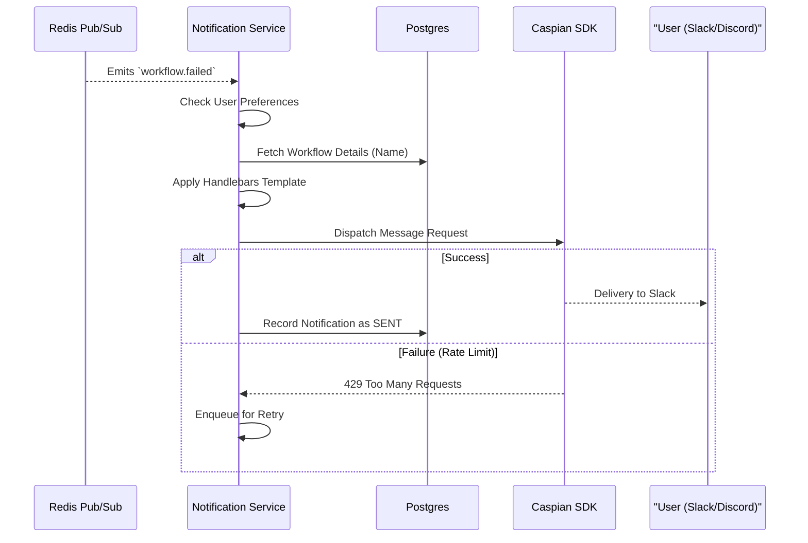

# Notification Architecture: FlowPilot

## 1. Purpose
The Notification Service is responsible for translating system events into human-readable messages and dispatching them across external communication channels. 

It acts as the edge boundary between FlowPilot's internal event-bus and external users.

## 2. Notification Flow

## 3. Core Responsibilities

### 3.1 Event Consumption
The Notification Service subscribes to specific terminal events via the central event bus:
- `workflow.completed`
- `workflow.failed`
- `step.failed` (optional based on user verbosity settings)

### 3.2 Template Resolution
The service must translate JSON event payloads into structured Markdown or channel-specific rich blocks. It maintains templates for different event types.
- Example: `"Workflow {{workflow.name}} failed at step {{step.taskId}} due to: {{error_details}}"`

### 3.3 Channel Dispatching via Caspian SDK
FlowPilot uses the external **Caspian SDK** to abstract away the complexity of communicating with multiple messaging APIs (Slack, Telegram, Discord). The Notification Service maps internal users to their Caspian identities and triggers dispatch.

## 4. Design Decisions & Trade-offs

### 4.1 Strict Decoupling from Orchestrator
- **Why Chosen:** The Orchestrator must never make HTTP calls to Slack or the Caspian SDK. If the Slack API goes down, or Caspian rate-limits us, it should *never* cause a Workflow to pause or fail. By communicating entirely via the event bus, the Notification Service absorbs all latency and failure associated with external networking.

### 4.2 Fire-and-Forget (MVP) vs Delivery Guarantees (Production)
- **Why Chosen (MVP Fire-and-Forget):** The Notification Service listens to Redis Pub/Sub. If it dispatches to Caspian and it fails, it may attempt one retry but will ultimately drop the message. 
- **Future Production Constraint:** In a production SaaS, users pay for reliable alerts. We will need to upgrade to **At-Least-Once Delivery**. The Notification Service will consume from a durable Kafka topic, and will only commit its consumer offset *after* the Caspian SDK returns a `200 OK`. If it crashes, Kafka will resend the event, ensuring no alerts are ever lost.

## 5. Future Scalability

### 5.1 Batching and Rate Limiting
- **Future Production:** If a user submits a batch of 50 workflows that all fail simultaneously, they will receive 50 distinct Slack notifications in one second, which is a terrible UX and risks Slack API rate limits. The Notification Service will implement a Debounce/Batching layer: waiting 30 seconds to aggregate similar events before dispatching a single summary message ("50 workflows failed").
