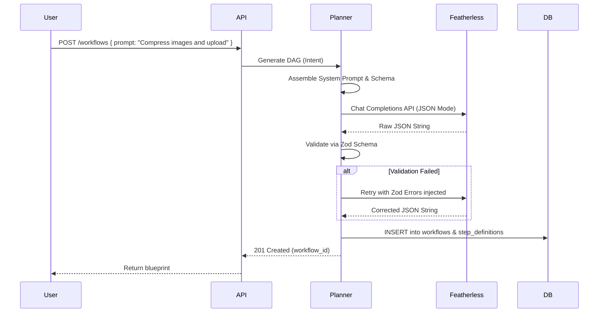

# AI Planner: FlowPilot

## 1. Purpose
The Planner Service is the intelligence layer of FlowPilot. Its sole responsibility is to translate unstructured natural language from the user into a structured, deterministic, executable Workflow Directed Acyclic Graph (DAG) in JSON format. 

**CRITICAL RULE:** The AI *never* executes work. It only plans. 

## 2. Planning Flow

## 3. Responsibilities

### 3.1 Prompt Construction
The Planner must assemble a highly restrictive System Prompt. It provides the LLM with:
1. The objective (translate text to DAG).
2. The list of strictly supported `taskId`s (e.g., `["HTTP_REQUEST", "COMPRESS_IMAGE", "SEND_EMAIL"]`). The AI is not allowed to hallucinate capabilities.
3. The JSON Schema defining the required structure for the DAG.

### 3.2 JSON Validation Pipeline
LLMs hallucinate. The Planner Service treats the output from Featherless as untrusted user input. 
- The raw output is parsed.
- It is passed through a strict **Zod** schema.
- The schema verifies structural integrity, ensures all `taskId`s are supported by the system, and verifies that `depends_on` references valid steps (detecting cycles).

### 3.3 Automated Self-Correction (Error Handling)
If the Zod validation fails, the Planner intercepts the error. Instead of failing the user request immediately, it automatically re-prompts the LLM. 
- **Feedback Loop:** It sends the original output back to the LLM along with the specific Zod error messages (e.g., `"Error at path steps[1].taskId: Expected one of ['HTTP', 'EMAIL'], received 'SEND_SMS'"`).
- **Limit:** This self-correction loop will terminate and fail after 3 attempts to prevent infinite billing loops.

## 4. Design Decisions & Trade-offs

### 4.1 Featherless (OpenAI-Compatible)
- **Why Chosen:** Featherless provides serverless execution for open-source models using the standard OpenAI REST API format. This allows us to hot-swap models without writing custom API integration code.
- **Alternatives Considered:** Building custom API integrations for Anthropic, Google Gemini, and OpenAI.
- **Why Rejected:** High engineering overhead for the MVP. We will strictly utilize providers that adhere to the OpenAI API contract.

### 4.2 Single-Shot Planning vs Agentic Planning
- **Why Chosen (Single-Shot):** The Planner takes the user's intent, generates the DAG entirely upfront, and returns it. It does not actively monitor execution or dynamically alter the plan mid-flight. 
- **Alternatives Considered:** Agentic architecture (where the AI executes Step 1, looks at the result, and decides what Step 2 should be).
- **Why Rejected:** Agentic loops are notoriously unpredictable, slow, and impossible to reliably audit. Single-shot DAG generation guarantees deterministic execution. Users can audit the *entire* plan before the Orchestrator starts running it.

## 5. Future Scalability

### 5.1 Tool Definition Registry (Production)
For the MVP, the supported `taskId`s are hardcoded into the Planner's system prompt. 
- **Future Production:** As the system scales to hundreds of worker capabilities, injecting all of them into the prompt will exceed context limits and degrade instruction following. We will need to implement a RAG (Retrieval-Augmented Generation) step: The Planner will embed the user's prompt, search a Vector Database of supported tools, and only inject the 10 most relevant tools into the LLM context.
