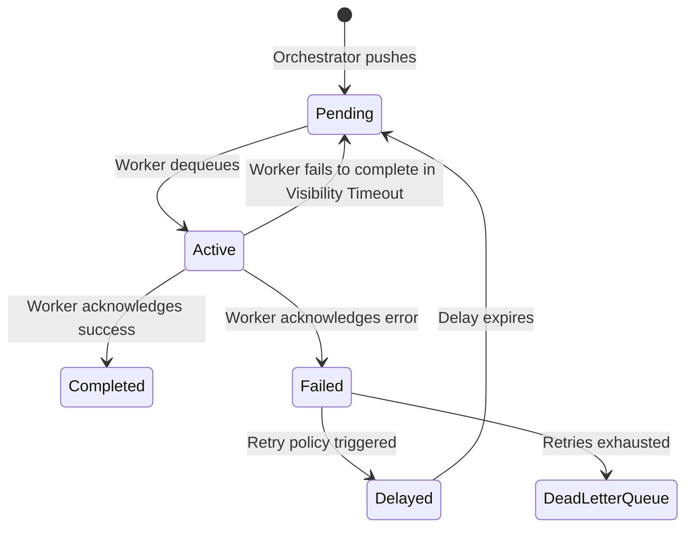

# Queue Architecture: FlowPilot

## 1. Purpose
The Queue acts as the highly-available buffer between the Orchestrator (which produces tasks) and the Workers (which consume tasks). This document outlines how tasks are enqueued, secured, and retired.

See [SCHEDULER.md](SCHEDULER.md) for how the Orchestrator determines *when* to enqueue a task.

## 2. Job Lifecycle & Queue States

## 3. Core Responsibilities

### 3.1 Redis Abstraction Layer
The rest of the system (Orchestrator and Workers) must **never** import a Redis library directly (e.g., `ioredis`). They interact exclusively with the `packages/queue` SDK.
- **Functions Exposed:** `enqueue(taskId, payload, delay_ms)`, `dequeue(taskId)`, `acknowledge(job_id)`, `fail(job_id)`.

### 3.2 Visibility Timeouts (Locking)
When a Worker dequeues a job from Redis, the job is not deleted. It is moved to an "Active" state with a visibility timeout (e.g., 30 seconds). 
- If the Worker crashes before sending `acknowledge()` or `fail()`, the visibility timeout will eventually expire, and Redis will push the job back into the "Pending" queue for another worker to pick up.
- This guarantees **at-least-once** delivery.

### 3.3 Dead Letter Queue (DLQ)
If a job throws an error, it is evaluated by the Orchestrator's retry logic. If all retries are exhausted (or if the job fundamentally causes crashes continuously—a "poison pill"), it is routed to the DLQ. Jobs in the DLQ remain there for manual engineering inspection and can be replayed later.

## 4. Design Decisions & Trade-offs

### 4.1 Redis (BullMQ / Custom Scripts)
- **Why Chosen:** Redis is ubiquitous, fast, and already used as an in-memory datastore. It avoids introducing an entirely new infrastructural component (like RabbitMQ or Kafka) for a two-week MVP while still supporting complex queueing features (delayed jobs, parent-child flows) via LUA scripting or libraries like BullMQ.
- **Alternatives Considered:** RabbitMQ (AMQP)
- **Why Rejected:** Managing RabbitMQ exchanges, routing keys, and durable disk configurations is overly complex for the initial scale.

### 4.2 Push vs Pull Queue Consumption
- **Why Chosen (Pull / Long-Polling):** Workers issue a blocking pop command (`BLPOP` in Redis) to wait for jobs. This ensures Workers are only assigned work when they are explicitly idle and ready. It provides native backpressure to the Orchestrator.

## 5. Future Scalability

### 5.1 Kafka / AWS SQS Migration (Production)
For the MVP, Redis stores all pending jobs in memory.
- **Future Production Risk:** If the Orchestrator enqueues 1,000,000 jobs faster than the workers can consume them, Redis will OOM (Out of Memory) and crash, taking the entire orchestration platform offline.
- **Evolution:** As FlowPilot matures, the `packages/queue` abstraction will swap its underlying implementation from Redis to AWS SQS (infinite storage scaling) or Apache Kafka (durable log structure), ensuring extreme backpressure resilience. Because no service directly imports Redis, this migration will require zero changes to the Orchestrator or Workers.
