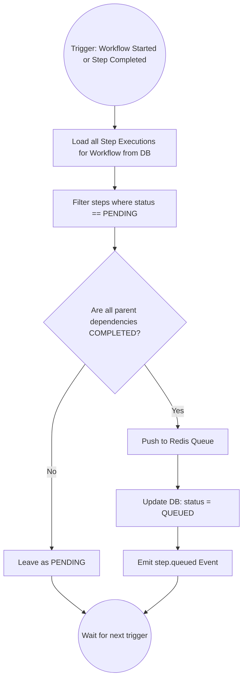

# Scheduler & Orchestration: FlowPilot

## 1. Purpose
The Orchestrator acts as the central brain of FlowPilot. This document outlines the scheduling logic—how the system evaluates a Directed Acyclic Graph (DAG) of steps, determines what is ready to run, manages concurrency, handles retries, and gracefully recovers from failures.

See [WORKERS.md](WORKERS.md) for how tasks are executed and [QUEUE.md](QUEUE.md) for how tasks are buffered.

## 2. DAG Resolution Lifecycle

When a Workflow Execution begins, or when a Step Execution completes, the Orchestrator must evaluate the DAG to determine what to do next.

## 3. Core Responsibilities

### 3.1 Dependency Checking
The Orchestrator fetches the `depends_on` array for every `PENDING` step. It cross-references these parent IDs against the current status of those parent steps in the database.
- If all parents are `COMPLETED`, the step is unlocked.
- The Orchestrator resolves the `payload_template` by merging the `output_payload` of the parent steps into the `input_payload` of the unlocked step.
- The step is pushed to the Queue.

### 3.2 Parallel Execution
FlowPilot natively supports parallel execution. If an AI Planner generates a DAG where Step B and Step C both depend on Step A, the moment Step A completes, the Orchestrator will simultaneously push Step B and Step C to the Queue. 
- **MVP Constraint:** We rely on the physical number of active Workers to dictate true parallelism.

### 3.3 Retry Policy & Failure Handling
When a `step.failed` event is received, the Orchestrator evaluates the step's `retry_policy` (e.g., `{"max_attempts": 3, "backoff_ms": 5000}`).
- **If attempts < max_attempts:** The step status becomes `RETRYING`. The Orchestrator pushes the task to a **Delayed Queue** in Redis, scheduling it to become visible to workers only after the `backoff_ms` expires.
- **If attempts >= max_attempts:** The step status becomes `FAILED`. The Orchestrator marks the entire Workflow Execution as `FAILED` and cancels any currently running sibling steps.

### 3.4 Worker Assignment
The Orchestrator *does not* assign tasks to specific workers (Push model). Instead, it publishes tasks to generic Redis queues grouped by `taskId`. 
Workers pull from the queues they are configured to support.

## 4. Design Decisions & Trade-offs

### 4.1 "Pull" Routing vs "Push" Routing
- **Why Chosen (Pull):** Workers poll Redis queues. The Orchestrator does not need to know the IP addresses or health of workers to assign tasks. If we suddenly spin up 50 new workers, they immediately start draining the queue without the Orchestrator needing to rebalance load.
- **Alternatives Considered:** Orchestrator maintains a registry of workers and pushes HTTP requests to them.
- **Why Rejected:** Incredibly fragile. Requires complex service discovery, handling network partitions, and implementing circuit breakers in the Orchestrator. The Pull model naturally provides backpressure.

### 4.2 Handling Concurrency & Race Conditions
- **Problem:** If Step B and Step C complete at the exact same millisecond, two parallel Orchestrator processes might attempt to resolve Step D simultaneously, resulting in Step D being enqueued twice.
- **Why Chosen (Postgres Advisory Locks):** For the MVP, when the Orchestrator evaluates the DAG for `workflow_id = 123`, it will acquire a Postgres advisory lock (`pg_advisory_xact_lock`) on the workflow ID. This guarantees that only one Orchestrator instance can process state transitions for a given workflow at any one time, entirely eliminating race conditions.
- **Alternatives Considered:** Distributed locking via Redis (`Redlock`).
- **Why Rejected:** Adds unnecessary failure modes. Since the state lives in Postgres, locking the transaction in Postgres is safer and simpler.

### 4.3 Template Resolution Engine
- **Why Chosen (JSONPath / Liquid):** When Step B depends on Step A, the Orchestrator must inject Step A's output into Step B's input. We will use a lightweight templating engine (like `lodash.template` or JSONPath interpolation) to securely map data.
- **Example:** `{"url": "{{ steps.stepA.output.image_url }}"}`

## 5. Future Improvements

### 5.1 Fair-Share Scheduling (Production)
In a multi-tenant SaaS environment, User A might enqueue 10,000 tasks, starving User B who only enqueued 1 task. The MVP uses a strict FIFO (First In, First Out) queue. 
- **Future Production:** Implement Priority Queues or Fair-Share Scheduling (Round Robin by Tenant ID) to ensure large workflows do not monopolize worker pools.

### 5.2 Dynamic Resource Allocation
Currently, a worker executes any task it pulls. In the future, tasks should declare resource requirements (`{"cpu": 2, "ram_gb": 4}`). The Orchestrator will interface with a Kubernetes operator to dynamically spin up Pods that match those exact resource requirements rather than relying on a static pool of workers.
