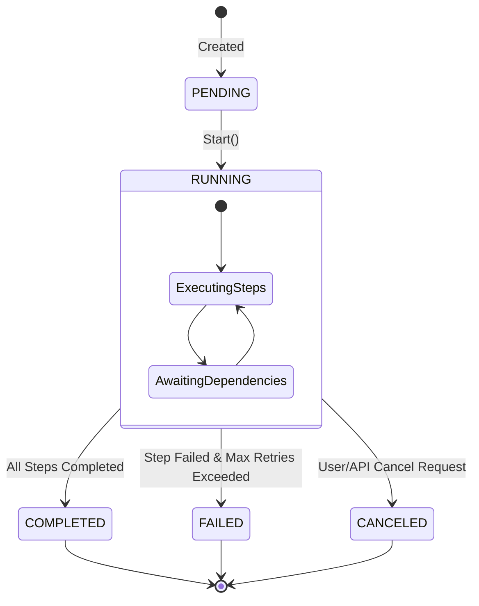
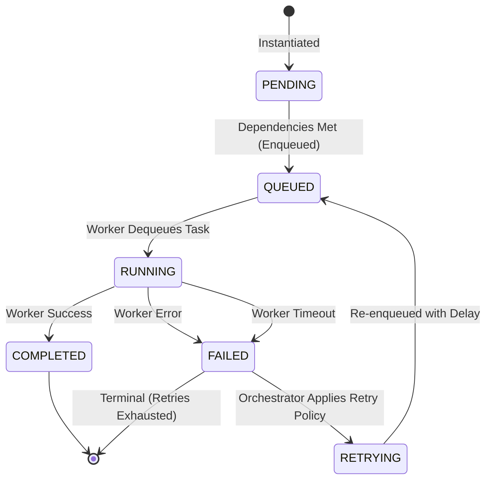
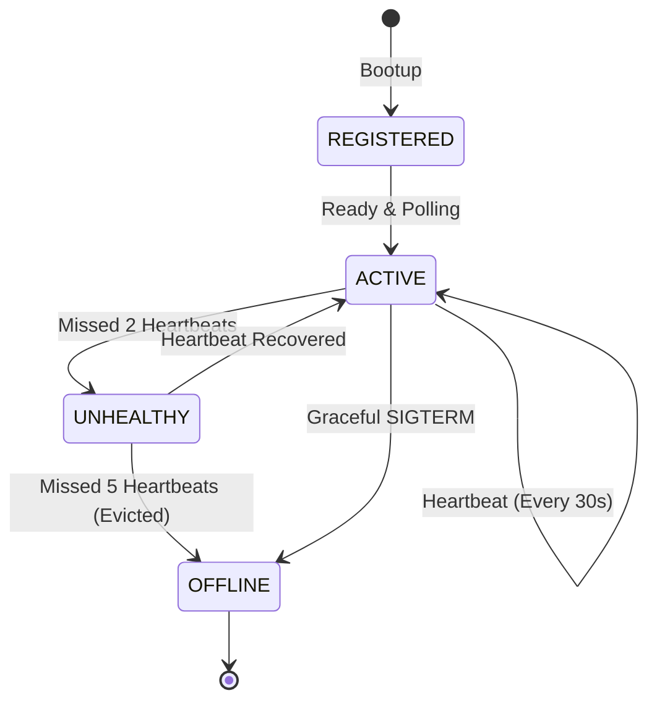

# State Machine: FlowPilot

## 1. Purpose
This document strictly defines the state lifecycles for Workflows, Steps, and Workers in FlowPilot. The Orchestrator is the sole authority permitted to execute these state transitions. State transitions must be atomic and must emit the corresponding system event outlined in [EVENTS.md](EVENTS.md).

## 2. Workflow Execution Lifecycle

A Workflow Execution represents the macro-level state of a user's generated DAG.

### 2.1 State Definitions
- **PENDING**: The workflow has been inserted into the database but the Orchestrator has not yet begun resolving its root dependencies.
- **RUNNING**: The orchestrator is actively managing the DAG. At least one step is either queued, running, or awaiting dependencies.
- **COMPLETED**: Every single step in the DAG successfully reached the \`COMPLETED\` state. This is a terminal state.
- **FAILED**: A step failed, exhausted its retry policy, and the orchestrator deemed the workflow unrecoverable. Terminal state.
- **CANCELED**: An external actor (User/API) explicitly requested termination. Any running steps are sent cancellation signals. Terminal state.

---

## 3. Step Execution Lifecycle

A Step Execution is the micro-level unit of work. Its lifecycle is far more volatile than the Workflow as it interacts with external Workers.

### 3.1 State Definitions
- **PENDING**: Step is waiting for its parent dependencies to complete. It is invisible to the Queue.
- **QUEUED**: Dependencies are resolved. The payload has been pushed to Redis. Waiting for a Worker.
- **RUNNING**: A Worker has locked the task and is executing it.
- **RETRYING**: The task failed, but the retry policy permits another attempt. The Orchestrator schedules it for future execution.
- **COMPLETED**: Worker returned a successful result payload. Terminal state.
- **FAILED**: Worker crashed, timed out, or explicitly returned an error, AND no retries remain. Terminal state.

---

## 4. Worker Lifecycle

Workers are ephemeral compute nodes. The Orchestrator monitors their lifecycle to handle zombie tasks.

### 4.1 Zombie Task Recovery (Failure Handling)
If a worker transitions from \`ACTIVE\` to \`UNHEALTHY\` while holding locks on \`RUNNING\` steps, the Orchestrator initiates **Zombie Recovery**:
1. Identify all steps where \`status = RUNNING\` and \`worker_id = {unhealthy_worker_id}\`.
2. Transition those steps to \`FAILED\` with error \`WORKER_DIED\`.
3. Apply standard Retry Policies to those steps.

## 5. Design Decisions & Trade-offs

### 5.1 No "PAUSED" State for MVP
- **Why Chosen:** Pausing a workflow implies persisting intermediate context and managing complex resume logic across distributed workers. It significantly increases the complexity of the Orchestrator.
- **Alternatives Considered:** Adding a \`PAUSED\` state for human-in-the-loop approvals.
- **Why Rejected:** Out of scope for a two-week MVP. 
- **Future Improvement:** We will introduce a \`PAUSED\` state to support Approval Steps (e.g., "Wait for Manager Slack Approval before Deployment").

### 5.2 Decoupling Queued from Running
- **Why Chosen:** A step is \`QUEUED\` when it enters Redis, but \`RUNNING\` when a worker actually begins processing it. This distinction allows the Dashboard to calculate "Queue Wait Time" versus "Execution Time", which is critical for scaling metrics.

### 5.3 Event-Sourced Transitions
- **Rule:** A database state mutation `UPDATE step_executions SET status = 'RUNNING'` must *always* occur in the same database transaction as `INSERT INTO events (event_type) VALUES ('step.running')`. This guarantees the event ledger perfectly mirrors the state machine.
