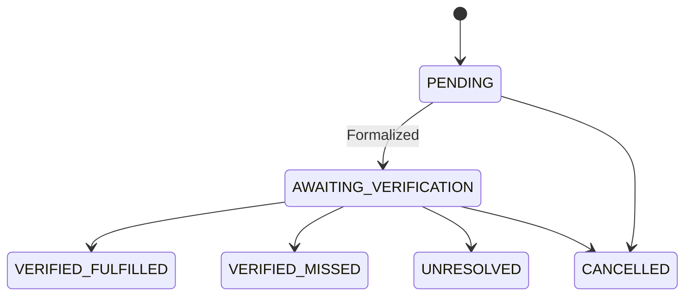
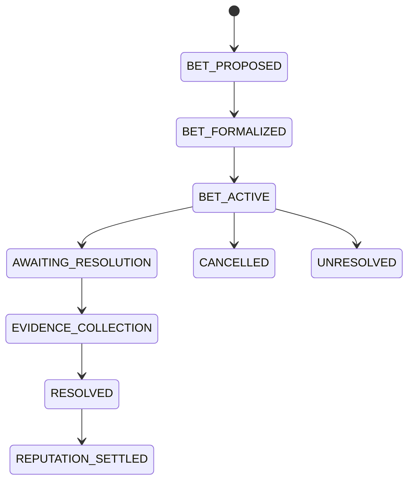

# State Machines: Aether

## 1. Commitment Lifecycle

**Note on Cancellation**: If a user cancels a commitment (and policy permits), it enters `CANCELLED`. It does *not* count as `MISSED` and does not apply penalties.

## 2. Bet Lifecycle

