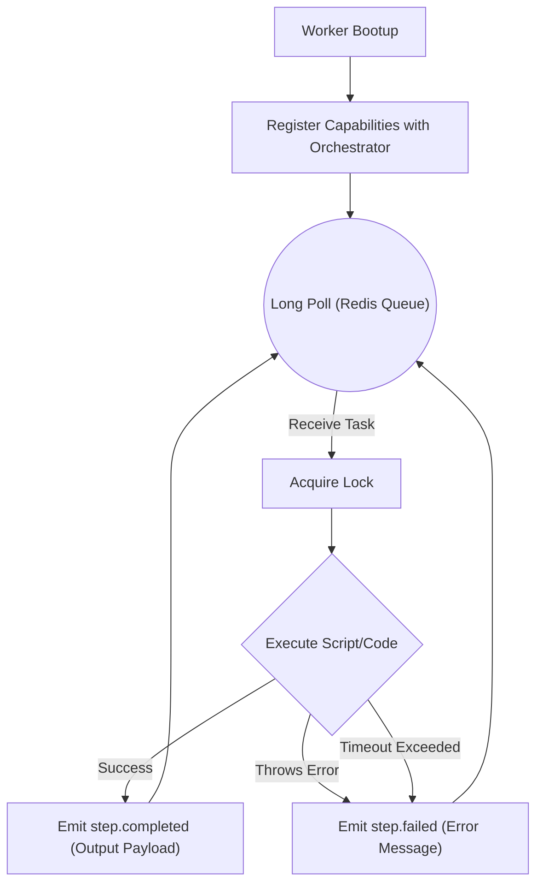

# Worker Architecture: FlowPilot

## 1. Purpose
The Worker Service executes the physical compute associated with a step in the workflow graph. Workers in FlowPilot are designed to be entirely "dumb," stateless, and horizontally scalable. 

For scheduling logic, refer to [SCHEDULER.md](SCHEDULER.md). For how tasks are buffered to the workers, see [QUEUE.md](QUEUE.md).

## 2. Worker Execution Loop

## 3. Core Responsibilities

### 3.1 Registration & Capabilities
Upon boot, a Worker must register itself with the Orchestrator. It announces its `hostname` and an array of `supported_task_ids` (e.g., `["http.request", "image.compress"]`). The Orchestrator uses this to track fleet capacity, but does *not* use it to push tasks.

### 3.2 Heartbeats
Workers are ephemeral and untrusted. 
- While active, a Worker fires an HTTP heartbeat to the Orchestrator every 30 seconds.
- If a Worker crashes mid-execution (OOM kill, power loss) and misses heartbeats, the Orchestrator will initiate Zombie Recovery to fail and retry any tasks that were locked by that worker.

### 3.3 Execution Flow & Timeouts
Workers no longer execute based on hardcoded enums. They resolve execution dynamically based on registered `taskId`s.

**Execution Flow:**
`Planner` &rarr; `Workflow JSON` &rarr; `taskId` &rarr; `Scheduler` &rarr; `SQS / Redis` &rarr; `Worker` &rarr; `Task Registry` &rarr; `Task Implementation`

Workers dequeue a `StepExecution` payload. 
- The payload contains the fully resolved input variables required for the task.
- The worker executes the associated function logic by looking up the `taskId` in the `task-registry`.
- **Strict Timeouts:** Every task type has a predefined timeout (e.g., HTTP = 10s). The worker process enforces this timeout strictly using `Promise.race()`. If the task times out, the worker forcefully rejects the promise and emits a `step.failed` event.

## 4. Design Decisions & Trade-offs

### 4.1 Dumb Workers vs Smart Workers
- **Why Chosen (Dumb):** Workers do not know they are part of a workflow. They are unaware of dependencies, previous steps, or future steps. They only know: "I received X, I must produce Y." This ensures workers remain infinitely horizontally scalable and perfectly idempotent.
- **Alternatives Considered:** Workers maintaining local state or pulling the entire DAG to execute locally.
- **Why Rejected:** If a worker holding a local DAG crashes, the entire workflow is lost. Distributed execution requires state to live centrally in Postgres/Orchestrator.

### 4.2 Handling Heterogeneous Workloads
- **Why Chosen:** A single worker binary will support multiple `taskId`s. We configure which types a specific worker instance listens to via environment variables (`SUPPORTED_TASKS="http.request,database.query"`). This allows us to scale specialized worker groups (e.g., Heavy CPU workers vs IO workers) independently.

## 5. Future Scalability

### 5.1 Docker / Kubernetes Isolation
- **MVP Constraint:** For the MVP, workers execute tasks directly within the Node.js V8 runtime. This is acceptable for trusted, predefined integrations (like hitting a Slack API).
- **Future Production Constraint:** If FlowPilot allows users to execute custom JavaScript/Python code as a workflow step, running that code natively on our workers is a critical security vulnerability. 
- **Evolution:** Workers will become "Docker Dispatchers". When they pull a custom code task, they will spin up an ephemeral, deeply sandboxed Docker container (with no network access and strict CPU limits) to execute the code safely, returning the output via stdout before destroying the container.
