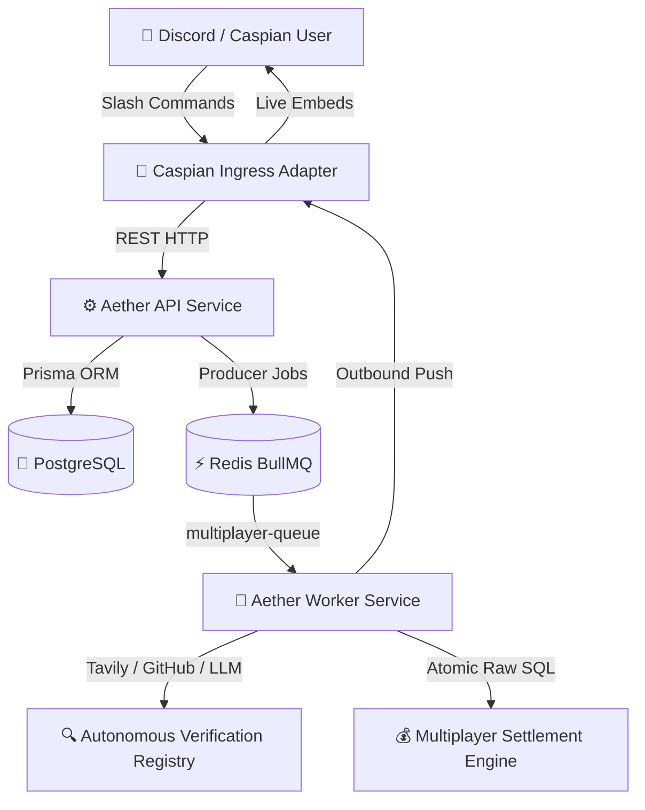

# 🌌 Aether Autonomous Verification & Multiplayer Engine
## Comprehensive Features, Commands & Testing Guide

---

## 🏛️ 1. Architecture Overview

Aether is an autonomous verification, decentralized reputation, and prediction engine for developer communities.



### Core Services
1. **`services/api`**: REST endpoints for commitments, single-player bets, multiplayer challenges, prediction markets, and leaderboard analytics.
2. **`services/worker`**: Autonomous background engine with BullMQ queues:
   - `multiplayer-queue`: Instant 1v1 auto-verifier and 5-second deadline sweeper.
   - `verification-queue`: Commitment & single-player bet verification.
   - `check-queue`: Stateless instant fact-checking.
   - `webhook-queue`: Real-time GitHub webhook processor for PR/issue fulfillment.
3. **`services/caspian`**: Bidirectional adapter connecting Discord / Telegram / Slack communication channels with natural deadline parsing and instant response streaming.
4. **`packages/database`**: PostgreSQL schema with Prisma ORM and additive migration history.

---

## 🎮 2. All Features & Command Reference

### 1. Head-to-Head (1v1) Peer Challenges 🥊
Users can create escrowed 1v1 wagers against specific opponents or open to anyone.

* **Targeted Challenge (Only specific user can accept):**
  ```bash
  /aether challenge @mystic for 20 REP on Bitcoin was above $20,000 in 2018
  ```
* **Open Challenge (First-come, first-served):**
  ```bash
  /aether challenge open 20 REP on Solana processed >50k TPS in 2023 by tomorrow
  ```
* **Accept a Challenge:**
  ```bash
  /aether accept <challengeId>
  ```
  *(Locks opponent's matching stake into escrow, immediately triggers autonomous web verification for past claims, or schedules verification at deadline).*
* **Cancel an Offered Challenge:**
  ```bash
  /aether cancel <challengeId>
  ```
* **List Active & Pending Challenges:**
  ```bash
  /aether challenges
  ```

---

### 2. Multi-User Prediction Markets / Pools 📊
A binary pari-mutuel prediction market supporting unlimited concurrent bettors on `YES` and `NO` sides.

* **Create a Prediction Market:**
  ```bash
  /aether market create "Bitcoin had higher price than 20000 in 2018" by 5 mins
  ```
* **Bet on YES or NO:**
  ```bash
  /aether bet <marketId> YES 20
  /aether bet <marketId> NO 30
  ```
* **View Market Details & Live Pool Odds:**
  ```bash
  /aether market <marketId>
  ```
* **List All Active Markets in Community:**
  ```bash
  /aether markets
  ```
* **Resolution & Settlement:**
  - Winning side shares the entire losing pool proportionally to their stake.
  - 5% fee (`500 bps`) routed to the community `RewardPool`.
  - Integer division dust routed to `RewardPool` to guarantee 0 REP leakage.
  - If `UNRESOLVED` (ambiguous/insufficient evidence), 100% of stakes are refunded 1:1.

---

### 3. Natural Language Deadline Parser ⏱️
Aether parses natural relative time expressions dynamically:
* `by 1 min` / `by 5 mins` / `by 30 minutes`
* `by 1 hour` / `by 2 hrs`
* `by tomorrow`
* `by next week`
* `by August 31, 2026`

---

### 4. Autonomous Single-Player Commitments & Bets 🎯
* **Create a Commitment:**
  ```bash
  /aether commit "I will merge PR #42 in owner/repo by tomorrow"
  ```
* **Self-Staking Bet (Single-Player with RewardPool Bootstrapping):**
  ```bash
  /aether bet 25 REP that "I will close issue #10 in owner/repo by Friday"
  ```

---

### 5. Stateless Fact Checking 🔎
* Verify any factual claim statelessly without staking REP:
  ```bash
  /aether check "Python was released in 1991"
  ```

---

### 6. Reputation & Leaderboard System 🏆
* **Check Personal REP Balance & Locked Escrow:**
  ```bash
  /aether rep
  ```
* **Global Reputation Leaderboard:**
  ```bash
  /aether leaderboard
  ```
* **Developer Impact Leaderboard (GitHub Contributions):**
  ```bash
  /aether impact
  ```
* **System Help Menu:**
  ```bash
  /aether help
  ```

---

## 🧮 3. Financial Invariants & State Machine

### Settlement Math
1. **Creator Win in 1v1**: 0% fee (Creator receives full pot: $2 \times \text{stake}$).
2. **Opponent Win in 1v1**: 5% protocol fee ($500\text{ bps}$) deducted from pot and credited to `RewardPool`.
3. **Prediction Market Proportional Payout**:
   $$\text{Payout}_i = \text{Stake}_i + \left\lfloor \frac{\text{Stake}_i \times \text{NetLosingPool}}{\text{WinningPool}} \right\rfloor$$
4. **Dust Conservation**: Any leftover fractional REP from integer division is credited to `RewardPool`.
5. **System Invariant**:
   $$\text{Total System REP} = \sum \text{AvailableBalance} + \sum \text{LockedBalance} + \sum \text{RewardPoolBalance}$$

---

## 🧪 4. Automated Test Suites & Validation

All 15 automated validation test suites in `services/worker/src/test_phase10.ts` pass with 100% success:

| Test # | Description | Result |
| :--- | :--- | :---: |
| **Test 1** | H2H Challenge Creation & Stake Escrow Locking | ✅ PASS |
| **Test 2** | Invalid Stake & Past Deadline Input Rejections | ✅ PASS |
| **Test 3** | Self-Acceptance & Insufficient REP Rejections | ✅ PASS |
| **Test 4** | Concurrent Acceptance Race Condition (`Promise.all`) | ✅ PASS |
| **Test 5** | H2H Settlement (Creator Win, 0% Fee) | ✅ PASS |
| **Test 6** | H2H Settlement (Opponent Win, 5% Fee to RewardPool) | ✅ PASS |
| **Test 7** | Challenge Cancellation & 100% Escrow Unlock | ✅ PASS |
| **Test 8** | Unresolved H2H Refund (1:1 Refund on Ambiguity) | ✅ PASS |
| **Test 9** | Prediction Pool Proportional Math, Dust & 5% Fee | ✅ PASS |
| **Test 10** | Prediction Market Unresolved Multi-User Refund | ✅ PASS |
| **Test 11** | Idempotency under 10x Simultaneous Settlement Calls | ✅ PASS |
| **Test 12** | Cross-Community Tenant Isolation | ✅ PASS |
| **Test 13** | Phase 8 Single-Player Bet Regression Suite | ✅ PASS |
| **Test 14** | Phase 9 Developer Impact & REP Leaderboard Regression | ✅ PASS |
| **Test 15** | Global Accounting Conservation Invariant Verification | ✅ PASS |

To run the full suite:
```bash
npx tsx services/worker/src/test_phase10.ts
npx tsx services/worker/src/test_phase9.ts
```

---

## 🚀 5. Git Pre-Push Inspection Summary

### Changed & New Files Ready for Commit:
* `packages/database/prisma/schema.prisma` *(MultiplayerBet, MultiplayerBetParticipant models & enums)*
* `packages/database/prisma/migrations/20260815000001_phase10_multiplayer_betting/` *(Additive migration)*
* `services/api/src/controllers/multiplayer.controller.ts` *(REST endpoints)*
* `services/api/src/services/multiplayer-bet.service.ts` *(API service)*
* `services/api/src/queue/producer.ts` *(Multiplayer Queue producer)*
* `services/worker/src/services/multiplayer-settlement.service.ts` *(Atomic raw SQL settlement)*
* `services/worker/src/multiplayer.worker.ts` *(Autonomous verification & auto-resolver)*
* `services/worker/src/index.ts` *(5s overdue background sweeper)*
* `services/caspian/src/index.ts` *(Natural deadline parsing, mentions, command interceptors)*
* `services/worker/src/test_phase10.ts` *(Validation suite)*
* `scripts/fund_test_accounts.ts` *(Account funding helper)*

**Verification Checklist:**
- [x] Zero hardcoded API keys or secrets in source code.
- [x] Zero breaking schema changes (strictly additive).
- [x] All 15 unit/integration test suites passing.
- [x] Docker stack (`api`, `worker`, `caspian`) verified and running.
- [x] **Safe to stage and push to git repository.**
