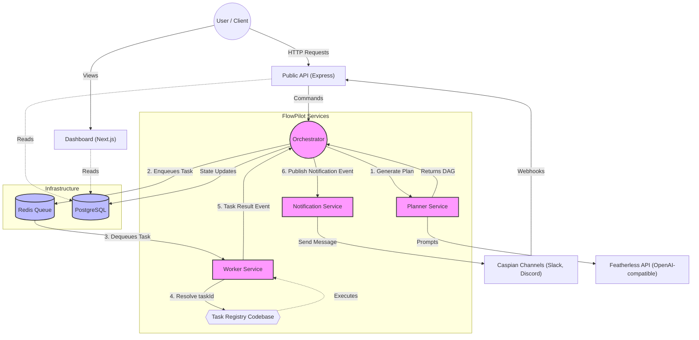

# FlowPilot Architecture Diagram

```mermaid
graph TD
    %% User & External
    User(("User / Client"))
    Caspian["Caspian Channels (Slack, Discord)"]
    Featherless["Featherless API (OpenAI-compatible)"]
    
    %% APIs and Frontend
    Dashboard["Dashboard (Next.js)"]
    API["Public API (Express)"]

    %% Core Services
    subgraph FlowPilotServices [FlowPilot Services]
        Orchestrator((Orchestrator))
        Planner[Planner Service]
        Worker[Worker Service]
        Notification[Notification Service]
        TaskRegistry{{Task Registry Codebase}}
    end

    %% Infrastructure
    subgraph Infrastructure
        RedisQueue[(Redis Queue)]
        Postgres[(PostgreSQL)]
    end

    %% Relationships
    User -->|HTTP Requests| API
    User -->|Views| Dashboard
    Caspian -->|Webhooks| API
    
    API -->|Commands| Orchestrator
    API -.->|Reads| Postgres
    Dashboard -.->|Reads| Postgres
    
    Orchestrator -->|1. Generate Plan| Planner
    Planner -->|Prompts| Featherless
    Planner -->|Returns DAG| Orchestrator
    
    Orchestrator -->|2. Enqueues Task| RedisQueue
    RedisQueue -->|3. Dequeues Task| Worker
    Worker -->|4. Resolve taskId| TaskRegistry
    TaskRegistry -.->|Executes| Worker
    Worker -->|5. Task Result Event| Orchestrator
    
    Orchestrator -->|State Updates| Postgres
    Orchestrator -->|6. Publish Notification Event| Notification
    Notification -->|Send Message| Caspian

    classDef service fill:#f9f,stroke:#333,stroke-width:2px;
    classDef infra fill:#bbf,stroke:#333,stroke-width:2px;
    class Orchestrator,Planner,Worker,Notification service;
    class RedisQueue,Postgres infra;
```
